

  
 

  

---

# PitPirate

## Another ESP32 BBQ thermometer gateway

####  Mainly coded by Claude Code 4.6 – but with love

#### _v1.0.1 | initial release_

## Sources are three-fold

1. ESP32 source in `/src/`:  
   Uses PlatformIO. So make sure to install this in VisualStudioCode.  
   Partitioning in `partitions_2mb_fs.csv`.  
   Adjust & rename `/include/config_DEFAULT.h/` then compile & flash.
2. Frontend App in `/frontend/`:  
   Uses vite.ts with TypeScript to compile a vue3.js + vuetify project.  
   So you will need node.js and npm.  
   Actions in `/frontend/package.json`.  
   Script `bulid` compiles into `/server/` and also in `/data/`. Those files go into the ESP32 FS.
3. Server in `/server/`:  
   Uses php for the backend / API side. All php scripts in `/server/php/`.  
   Adjust & rename `/server/php/config_DEFAULT.php/` then upload.  
   The Frontend app also builds in here to be served.  
   Basically upload this to your public webserver to use the API functions.

**Features (in loose order):**

- Tuya LAN protocol – polls the NC01 directly over local WiFi, no cloud dependency
- Up to 5 food probes (on the NC01) + ambient pit temperature
- HTTP/S requests handled in Core0 to make TFT and all the rest run smoothly
- High / Low alarms for each probe
- Battery level monitoring and display
- Webinterface for app settings and statistics
- WebNotifications (when installing the server-hosted app on your iOS start screen)
- PID algo for fan blower PWM control
- Touchscreen calibration screen
- mDNS support – reachable as `pitpirate.local`
- OTA firmware updates over WiFi
- Remote telemetry / debug logging to optional PHP server
- AP mode with captive portal for WiFi provisioning
- LittleFS-hosted frontend with gzip compression

**Resources:**

- Uses an ESP32 based [Cheap Yellow Display aka. "CYD"](https://macsbug.wordpress.com/2022/08/17/esp32-2432s028/ "CYD Information") _(website in Japanese)_  
  Mine is a 2432S028Rv3 – there are several sizes, versions revisions, sellers – most should be adaptable to this project.
- ESP32: PlatformIO- Display driver: [TFT_eSPI](https://github.com/Bodmer/TFT_eSPI)
- Touch driver: [XPT2046_Touchscreen](https://github.com/PaulStoffregen/XPT2046_Touchscreen)
- Graphics: [PNGdec](https://github.com/bitbank2/PNGdec) / [AnimatedGIF](https://github.com/bitbank2/AnimatedGIF)
- QR code: [QRcodeDisplay](https://github.com/yoprogramo/QRcodeDisplay)
- Filesystem: LittleFS- Icons: [Material Design Icons](https://pictogrammers.com/library/mdi/)  
  Icons inserted manually, so we don't need to include the whole font.  
  SVGs icons added to [/frontend/public/icons](/frontend/public/icons)  
  One icon needs to have the mdi-prefix, as it is requested via the <v-select> element (mdi-menu-down.svg)

**ToDOs:**

- ✅ Most stuff I need is there
- ✅ Add probe alarm settings to ESP32 TFT.
- ✅ Move HTTP stuff to Core-0 to make touchscreen more responsive.  
  Arduino HTTP is always synchronous and a laggy server replys otherwise blocks the whole ESP32.
- ✅ Add screenshot function for documentation.
- ✅ Add proper info & settings view to ESP32 TFT.
- ✅ Add touchscreen calibration
- 🔲 Make a metal adapter plate to fit the blower to the Kamado's air inlet.
- 🔲 Test USB blower fan contolling when it arrives.
- 🔲 Verify PID functionality.
- 🔲 Add servo control for blower pipe cutoff.
- 🔲 Replace "import `'vuetify/styles'"` in [vuetify.ts](frontend/src/plugins/vuetify.ts) to reduce css bundle size.

**Long term ideas:**

- 🔲 Allow switching from Centigrades to Fahrenheit, Kelvin or maybe even Rankine.
- 🔲 Support additional Tuya-based thermometer models.
- 🔲 Multi-device support (more than one thermometer device).
- 🔲 MQTT / HomeAssistant integration.
- 🔲 All those **super important** extra settings like _Meat Type_ or device native alarms seem to require Tuya cloud. We don't need them anyway. So don't hold your breath.

## The device

 _ToGrill NC01_

### Some notes about the NC01

- Holding the ON/OFF button turns the device ON/OFF
- Pressing the ON/OFF button once beeps and turns on the backlight of the display for some seconds.
- Double-pressing the ON/OFF button gives a beep and a rising tone – the backlight will remain on.  
  Double-pressing again will give a beep and a long beep – backlight will auto turn off again.
- I noticed that every day at around 00:00 it loses Wifi connectivity shortly, beeps in anguish and then just reconnects.

## The problem

Just like every other IoT device today the NC01 BBQ thermometer requires you to use a dedicated app that only runs on your cellphone.  
You can also use HomeAssistant or similar home automation frameworks. In the process of pairing the device you will need to register an account with [Tuya](tuya.com) and install their [SmartLife app](https://smartapp.tuya.com/smartlife "Tuya SmartLife app").  
This is the Chinese IoT cloud service that a lot of devices are based on – and this one doesn't even work properly with SmartLife! Temperatures are off by factor x10 and opening any settings make SmartLife go to a white screen of death.  
Basically the manufacturer employs the Tuya framework / services, but rolls their own protcol on top of it to trap you into their crappy app. Or because they don't care.  
Since I do not use any other home automation, I also don't have much insight into them. So if I miss anything here, tell me in the comment section. That also means I have zero inclination to implement HomeAssistant or similar frameworks. But be my guest.

## The solution

After obtaining the `deviceID` and `local_key` of your device, you can kiss the apps goodbye for good. **Yay!**

_Well almost, because when you need to re-pair the NC01 for any reason, the **local_key** will change too!_

PitPirate implements the Tuya LAN protocol to poll the NC01 directly over your local WiFi. All data stays on your network — no cloud accounts or phone apps required during normal operation. The ESP32 acts as a gateway: it reads probe data from the NC01 and serves it via a local web interface and
optional push notifications.

## Accessing the NC01

### NOT Pairing with ToGrill app

The **ToGrill** app for [iOS](https://apps.apple.com/de/app/togrill/id1521795039) or [Android](https://play.google.com/store/apps/details?id=com.togrill.haibosi) is OK for what it does, but I generally dislike those apps.

_**If you must use it…**_

1. Open the **ToGrill** app and register an account with them.
2. Add a new device by pressing the **+** and scanning the QR on the back of the device, then entering Wifi credentials.  
   **_I highly recommend a seperate and dedicated Wifi for this, since you never know what those IoT devices of unclear origin will try to do in your network!_**  
   **_Make sure to not enable Layer-2-Blocking or similar mechanisms tho, because devices will obviously have to talk to each other on the Wifi!_**
3. Reset the device by power cycling it and the pres the **Pair** button on the back (hidden under the fold out stand).
4. The device display will blink - that means you can pair it.  
   1-5. After successfull pairing the **ToGrill** app will be ready to control the NC01.

## Commanding it to do your own bidding is way more fun!

### 1. Connecting to Tuya.com

_tl;dr: You need to aquire **Device ID**, **local_key** and **local IP**_  
_Well technically only the **local_key**, but the process is still required…_

1. Make an account with [Tuya](tuya.com)
2. Log into [Tuya Developer Platform](https://platform.tuya.com/)
3. Download their [Tuya SmartLife](https://smartapp.tuya.com/smartlife "Tuya SmartLife app") app
4. Open the app and log in using your Tuya.com account. Make sure BlueTooth is enabled and that Tuya may use it to pair devices.
5. Reset the device by power cycling it and then press/hold the **Pair** button on the back (hidden under the fold out stand). When the display backlight blinks, you have 3 minutes for the pairing process.
6. In Tuya app add a new device by pressing the **+** and selecting the ToGrill device, then enter desired Wifi credentials.  
   **_I highly recommend a seperate and dedicated Wifi for this, since you never know what those IoT devices of unclear origin will try to do in your network!_**  
   **_Make sure to not enable Layer-2-Blocking or similar mechanisms tho, because devices will obviously have to talk to each other on the Wifi!_**
7. Create your own **Cloud App** to gain access to the NC01's credentials:  
   (as of March 30 2026 / this may change. But the information is in there somewhere…)
8. Via the **_left navigation menu_** go to **_Cloud ➞ Project Management ➞ Create Cloud Project_** and create a project.
9. Then go to Devices > **_Cloud ➞ Project Management ➞ Devices Link ➞ App Account_** and press **_Add App Account Tuya ➞ App Account Authorization_**. A QR code will show.
10. Open your TUYA app again, go to **_Profile_** and press the QR-code scanner icon **[-]**, then scan the QR from the previous step.
11. Select **_Custom Link_** as the **_Device Linking Method_**, then select your device and take note of the **_Device ID_** – or get it later.
12. Next we need to obtain the device's **_local_key_**: Go to **_Cloud ➞ API Explorer_** and on the site that opens to **_Device Management ➞ Query Device Details in Bulk_**. Enter the device*id from the previous step and submit the request. In the result window you should now see the device
    details, including \*\*\_local_key*\*\*. Take note of that too.
13. I was about to write how you might obtain the device's local IP (Tuya cloud only has the public IP), but then remembered how the device regularly blasts UDP beacons on port 6667 into the LAN anyway.  
    Turns out those use a _hardcoded_ encryption key - which makes identifying our device safe and obtaining it's IP simple!  
    In case the item's IP changes, the ESP32 automatically snatches any Tuya UDP beacons, decrypts them and compares the included device ID with the one we use. If that matches, the local IP is updated to NVS and we are back in business!

    **Example UDP message:** `{"ip":"192.168.60.55","gwId":"<redacted>","active":2,"ablilty":0,"encrypt":true,"productKey":"<redacted>","version":"3.4","token":true,"wf_cfg":true}`

### **So now you finally have the _local_key_** to the device you already payed money for. Cool. Let's use it!

---

### 3. Preparing your Server and ESP32 settings

#### Server Settings

1. Enter the required **Server Settings** into [server/php/config_DEFAULT.php](server/php/config_DEFAULT.php "Server Settings")
   - Use [server/php/generate-keys.php](server/php/generate-keys.php) to generate **VAPID_PUBLIC_KEY** and **VAPID_PRIVATE_KEY**
   - **ALARM_SECRET** and **SECRET_TOKEN** need to be the same as in the ESP32's [include/config.h](include/config.h) (see next section)
   - **VAPID_SUBJECT** is your eMail address and **SUBSCRIPTIONS_FILE** can stay as is.
2. Save the file as [server/php/config.php](server/php/config.php) to become functional

#### ESP32 Settings

1. Enter the required **ESP32 Settings** into [include/config_DEFAULT.h](include/config_DEFAULT.h "ESP32 Settings")
   - **ALARM_SECRET** and **SECRET_TOKEN** need to be the same as in the server's [server/php/config.php](server/php/config.php)
   - **WIFI_SSID** and **WIFI_PW** can be set or can be left blank, the ESP32 will then boot into AP mode.
   - Same for **TUYA_DEVICE_IP**, **TUYA_DEVICE_ID** and **TUYA_LOCAL_KEY** – all of these can be set on the ESP32's **Setting page** later.
   - Add **REMOTE_POST_URL** and **REMOTE_POST_TOKEN** for remote logging to the server (recommended, _not_ setable via the Settings later!).
   - Adjust **NTP_SERVER** and **NTP_TZ** as needed.
2. Save the file as [include/config.h](include/config.h) to become functional

---

### 4. Compilation

All required actions are in [frontend/package.json](frontend/package.json)

- **dev** runs the local vite development HMR build. Open the IP in the terminal output to see the frontend app.  
  This behaves pretty much like the ESP32-hosted version of the app. It has direct "hardware access" by the magic of PIO's ecosystem. And also live-compiles and updates whenever your change the frontend's code.
- **build** runs the build script. Including [text](scripts/build_frontend.py)  
  It will build the release version of the app into [server](server) and also bundle it for the ESP32's hosting.  
  That means it grabs the build output and gzips compressable files into [data](data). You won't be able to edit / list those files after that, but they will serve just fine from the ESP32 since it has gzip headers enabled.
- **install** installs the npm dependencies for the project

---

## Notifications

- After installing the server-hosted app on your iOS homescreen (maybe Android too, I haven't tested that) you can turn on notifications in the Settings.
- Those include connection errors, temperature limit alarms and low battery alarms.
- Implemented as [VAPID Web Push](https://web.dev/articles/push-notifications-overview) — the PHP server sends native push messages to the PWA without any app-store app.
- Requires the PHP server to be reachable from the internet (or your local network, for local-only use).
- VAPID keys are generated once via [server/php/generate-keys.php](server/php/generate-keys.php).

---

## AP Mode

_AP mode activates when…_

- connecting to the last known Wifi network fails on ESP32 reboot
- when you go to the settings via the TFT and press the **Boot AP** button. The ESP32 then opens up an accesspoint (AP) and the TFT displays the credentials plus a matching QR-Code.  
  The AP has a captive portal <a href="192.168.1.4">192.168.1.4</a>, so after joining it will send you to the frontend app hosted on the ESP32.  
  Go to the settings page first and scan for Wifi networks or enter one manually.  
  **Obviously this needs to be the same network as the NC01 is on!**  
  While here, set all other parameters that require adjustment.

---

## ⚠️ General Pitfalls

- Local HMR needs the ESP32 IP in [frontend/vite.config.ts](frontend/vite.config.ts):  
  `const ESP32_IP = 'http://192.168.179.7'`  
  After that running the `dev` command will allow you to live-compile the frontend and use the app just as if it was served from the ESP32!
- My CYD 2432S028Rv3 board misses two 5.1k resistors on the USB-C CC1 and CC2 lines.  
  That mean it works fine with the USB-C > USB-A cable that is included.  
  But with a USB-C <—> USB-C cable it doesn't work at all!  
  It fails to trigger the 5V power supply, preventing the board from turning on or being recognized.  
  If you are confident in soldering, you can add two 5.1kΩ resistors between the CC1 pin and GND, and CC2 pin and GND on the USB-C connector. This fixes the fundamental design flaw and allows USB-C to C communication.  
  Or use some sort of hub/adapter.
- littleFS on the ESP32 only supports 31 characters for filenames.  
  Mind that when adding new icons or other assets. There will be an error in the FS build but the build finishes – so ultimately that file will be missing.
- When switching probes on the NC01, the device will from there on out return the last know value for the empty probe slot/s.  
  Since we cannot (haven't found a way to) poll the probe configuration, you will see those slots pop up on the PitPirate after a reboot.

  _To resolve this you can either:_
  1. Press the **Reset** button on the back of the NC01. Cleanes solution, only takes 5 seconds.
  2. Pull out any probe and re-inset it. This will trigger a status update message from the NC01 to the ESP32 that informs it about active probes. Sadly the ESP32 cannot request this on it's own.

- The NC01 only knows four battery states: 100% / 66% / 33% / 0% (unsure about the 0%). No charging status.
- Probe values are always sent as integers scaled by x10.  
  E.g. `23°C` returns as `(int) 230` where the last digit is _always_ zero. So we don't mess with any fractional temperatures anywhere.
- When you run the `Touch Calibration` (Settings-2 screen), make sure to do all 4 corners properly! If you for example touch the middle of the screen instead of the bottom left corner and save, you will have a _bad_ time.  
  You will then need to erase the ESP32 flash to remove the NVS calibration setting.
- When `UART Logging` is `ON` (Settings-2 screen) and you press the GPIO_0 button (next to RESET on the back of the TFT), a screenshot is saved to `/server/php/screenshots`.  
   **Make sure to lower `DSPI_READ_FREQUENCY` in `platformio.ini` to 4000000 or even 2000000, or your screenshots will have color banding and errors. Or ultimatedly completely wrong colors.**
- `DSPI_FREQUENCY=80000000` (TFT SPI write = 80MHz) on the other hand works well for me and delivers really fast TFT refresh.

  _Here are examples of 2, 4, 8 and 16MHz:_

**_Screenshot @ 2MHz:_**  
 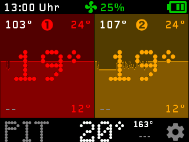  
_Great quality_

**_Screenshot @ 4MHz:_**  
 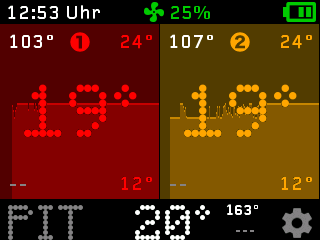  
_Great quality_

**_Screenshot @ 8MHz:_**  
 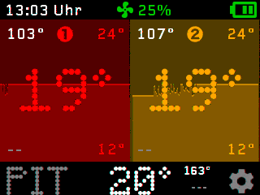  
_Banding and noise_

**_Screenshot @ 16MHz:_**  
 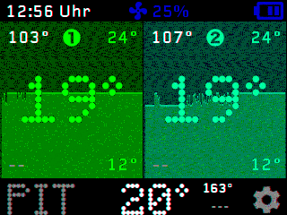  
_Colors shift, noisy like a Merzbow CD_

---

## Screenshots

**_Main Screen_**  
 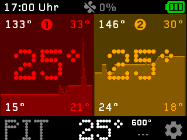  
_With two food probes and the ambient probe_

**_Probe-1 Alarm Setting_**  
 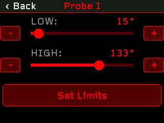  
_Capped at 200°C, the probes can do a bit more_

**_Probe-2 Alarm Setting_**  
 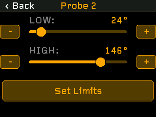  
_Capped at 200°C, the probes can do a bit more_

**_Probe-7 (ambient) Alarm Setting_**  
 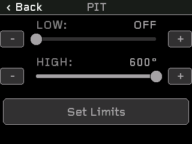  
_These go up to 600°C_

**_Settings Page 1_**  
 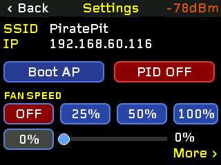  
_Main Settings_

**_Settings Page 2_**  
 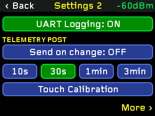  
_Additional Settings_

**_Touch Calibration Page_**  
 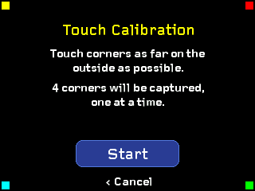  
_Explains itself_

**_AccessPoint (AP) Mode Page_**  
 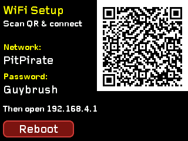  
_Use this to setup the ESP32_
