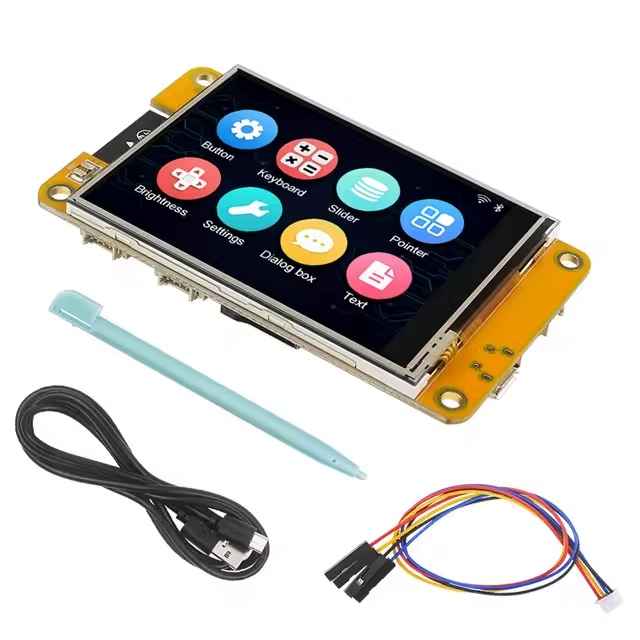
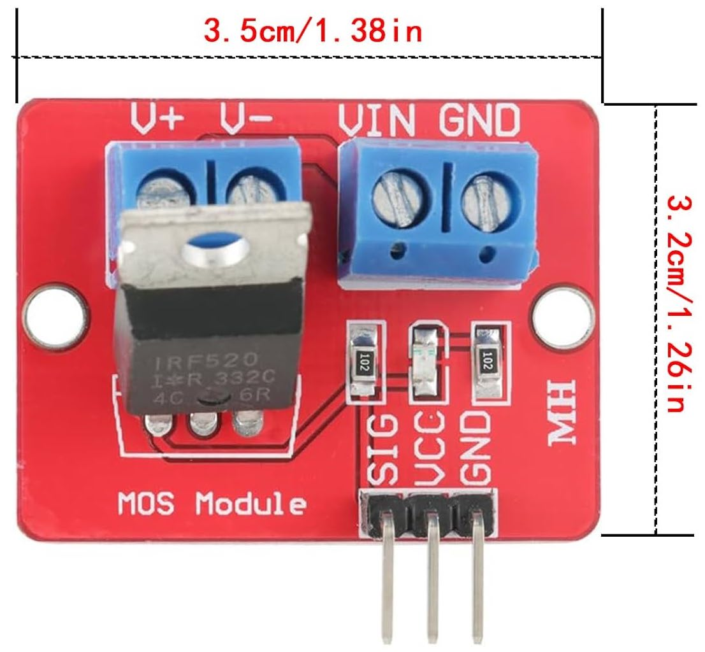
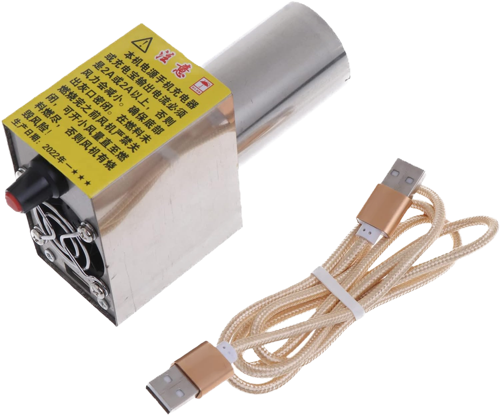
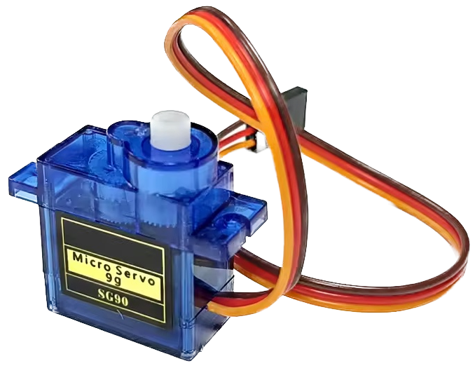

# Technical Details

---

## 1. Temperature flow: thermometer → ESP32

###### as explained by Claude Code

**Protocol: Tuya LAN v3.4 over TCP, not plain HTTP polling.**

The thermometer is a WiFi device on the same LAN. The ESP32 opens a persistent TCP connection to it on port 6668 and keeps it alive. The flow from tuya_lan.cpp:

### 1. One-time handshake (on connect)

`tuyaConnect()` does a 3-step session key negotiation:

- **cmd=3** → ESP32 sends AES-encrypted local nonce
- **cmd=4** ← device replies with its nonce + HMAC of ours (verified)
- **cmd=5** → ESP32 sends HMAC of device nonce

Session key = `AES_ENC(local_key, local_nonce XOR remote_nonce)`

After the handshake, the device immediately pushes unsolicited **cmd=8** frames. A 600 ms silence window drains those — importantly, `probe_state` (DP 16) **only arrives in these push frames**, not in query responses.

### 2. Two ongoing data paths

| Mechanism            | Trigger                                                      | Command                                                          |
| -------------------- | ------------------------------------------------------------ | ---------------------------------------------------------------- |
| **Periodic query**   | Every 30 s (or immediately if browser hits `/data?query=1`)  | cmd=16 sent with `{}` payload; device replies with all DP values |
| **Unsolicited push** | Device-initiated (probe inserted/removed, alarm trips, etc.) | cmd=8; drained every loop iteration                              |

**Heartbeat** (cmd=9) every 10 s keeps the TCP socket alive.

### 3. DP decoding

Every frame is AES-128-ECB decrypted with the session key. The payload is JSON like `{"2":1255,"3":983,"16":"Aw","1":85}`.

Key data points (from tuya_lan.cpp):

| DP         | Meaning                                                        |
| ---------- | -------------------------------------------------------------- |
| 1          | Battery %                                                      |
| 2–5, 28–30 | Probe temps (raw ÷ 10 = °C; ≤ −200 = disconnected)             |
| 16         | `probe_state` — base64-encoded byte, each bit = probe inserted |
| 23         | Cook alarm bitmap                                              |
| 106        | Device alarm                                                   |
| 107        | Device on/off                                                  |

### 4. State merge → `jsonData`

`applyDpsJson()` ([tuya_lan.cpp line 305](src/network/tuya_lan.cpp#L305)) merges incoming DPs into persistent static state (so a partial push doesn't erase other values), then re-renders the global `jsonData` string. That string is what the display, web server data endpoint, and remote telemetry
poster all read.

**In short:** it's a persistent TCP connection with a proprietary encrypted handshake — not plain IP polling. The 30 s query is supplemented by instant device-initiated pushes for events like probe insertion.

---

# 2. ESP32 Firmware Details

- OTA firmware partitioning (for now)
- AP mode for convenient reconfiguration

---

# 3. Frontend Details

---

# 4. Server Details

---

# 5. NC01 Tuya Cloud Details

- Look at _**documentation/TUYA Cloud API Explorer device information**_ for some example data and other stuff the device provides via the Tuya Cloud API Explorer.

---

# 6. Requird Hardware

- NC01 wireless BBQ thermometer [Aliexpress Link](https://de.aliexpress.com/item/1005006834715411.html "Aliexpress link")
- "Cheap Yellow Display" [Aliexpress Link](https://de.aliexpress.com/w/wholesale-ESP32-touchscreen-yellow-2.8.html "Aliexpress link")  
  **Make sure to it includes the 4p breakout jumper cable for CN1 to connect the blower fan** 
- Any 3.3V MOSFET driver board from Amazon. I got 6 pcs. for € 6,–, it really doesn't matter – as long as the FET can be triggered with 3.3V.  
  
- USB powered blower fan from Amazon  
   This will need adaption to the ESP32 PWM controlling. Still waiting for the package.  
   This will also require some sort of metal adapter plate to fit the Kamado's air inlet. 
- A simple RC servo like the SG90 [Aliexpress link](https://de.aliexpress.com/w/wholesale-SG90-servo.html) for the blower cutoff mechanism.  
  
